# Frontend-to-Backend Architecture Sequence Diagram

## System Overview
This diagram shows the complete data flow from frontend user interactions through backend processing and storage in the web data collection system.

## Architecture Components

### Frontend Components
- **User Browser**: Client-side interface
- **Static Pages**: HTML pages hosted on GitHub Pages
- **WASM Keystroke Capture**: Rust-based high-precision keystroke logging
- **Platform Clones**: Simulated social media interfaces (Facebook, Instagram, Twitter)

### Backend Components
- **Google Cloud Functions**: Serverless API endpoints
- **Google Cloud Storage**: File storage and data persistence

## Complete User Journey Sequence

```mermaid
sequenceDiagram
    participant U as User Browser
    participant SP as Static Pages<br/>(GitHub Pages)
    participant WASM as WASM Keystroke<br/>Capture (Rust)
    participant PC as Platform Clones<br/>(Facebook/Instagram/Twitter)
    participant GCF as Google Cloud<br/>Functions (saver)
    participant GCS as Google Cloud<br/>Storage

    Note over U,GCS: 1. User Registration & Consent Flow
    
    U->>SP: 1.1 Navigate to start_study.html
    SP->>U: 1.2 Return start page with launch check
    
    U->>SP: 1.3 Click "Start Study" → consent.html
    SP->>U: 1.4 Return consent form
    
    U->>SP: 1.5 Check consent checkbox
    SP->>SP: 1.6 Generate secure user ID
    SP->>SP: 1.7 Store user ID in secure cookie
    
    U->>SP: 1.8 Click "Continue to Demographics"
    SP->>GCF: 1.9 POST /saver (consent data)
    Note right of GCF: File: {userId}_consent.json
    GCF->>GCS: 1.10 Store consent data
    GCS-->>GCF: 1.11 Confirm storage
    GCF-->>SP: 1.12 Return success response
    
    SP->>GCF: 1.13 POST /saver (start time metadata)
    Note right of GCF: File: {userId}_start_time.json
    GCF->>GCS: 1.14 Store start time data
    GCS-->>GCF: 1.15 Confirm storage
    GCF-->>SP: 1.16 Return success response
    
    SP->>U: 1.17 Redirect to demographics.html
    
    Note over U,GCS: 2. Demographics Collection
    
    U->>SP: 2.1 Fill demographics form
    U->>SP: 2.2 Click "Next"
    SP->>SP: 2.3 Validate form data
    SP->>SP: 2.4 Add device information
    SP->>GCF: 2.5 POST /saver (demographics data)
    Note right of GCF: File: {userId}_demographics.json
    GCF->>GCS: 2.6 Store demographics data
    GCS-->>GCF: 2.7 Confirm storage
    GCF-->>SP: 2.8 Return success response
    SP->>U: 2.9 Redirect to instructions.html
    
    Note over U,GCS: 3. Study Instructions
    
    U->>SP: 3.1 Read study instructions
    U->>SP: 3.2 Click "Start Tasks"
    SP->>GCF: 3.3 POST /saver (start study data)
    Note right of GCF: File: {userId}_start_study.json
    GCF->>GCS: 3.4 Store start study data
    GCS-->>GCF: 3.5 Confirm storage
    GCF-->>SP: 3.6 Return success response
    SP->>U: 3.7 Redirect to tasks.html
    
    Note over U,GCS: 4. Task Execution Loop (18 tasks)
    
    loop For each task (1-18)
        U->>SP: 4.1 Load task page
        SP->>SP: 4.2 Calculate task parameters<br/>(platform, video, round)
        SP->>U: 4.3 Display video and task info
        
        U->>SP: 4.4 Click "Open Platform"
        SP->>PC: 4.5 Open platform in new tab<br/>with user_id parameter
        PC->>PC: 4.6 Initialize platform interface
        PC->>WASM: 4.7 Initialize keystroke capture
        WASM-->>PC: 4.8 Return capture instance
        
        Note over U,WASM: 4.9 User types response
        U->>PC: 4.9.1 Type in text input
        PC->>WASM: 4.9.2 Capture keystroke events
        WASM->>WASM: 4.9.3 Store timing data<br/>(press/release, timestamps)
        
        U->>PC: 4.10 Click "Post" button
        PC->>PC: 4.11 Validate post content
        PC->>WASM: 4.12 Get keystroke data
        WASM-->>PC: 4.13 Return CSV data
        
        PC->>PC: 4.14 Build submission files<br/>(CSV, TXT, metadata)
        PC->>GCF: 4.15 POST /saver (keystroke data)
        Note right of GCF: Files: {platform}_{userId}_{taskId}.csv<br/>{platform}_{userId}_{taskId}_raw.txt<br/>{platform}_{userId}_{taskId}_metadata.json
        GCF->>GCF: 4.16 Validate file format
        GCF->>GCF: 4.17 Extract user ID from filename
        GCF->>GCS: 4.18 Store keystroke data files
        GCS-->>GCF: 4.19 Confirm storage
        GCF-->>PC: 4.20 Return success response
        
        PC->>SP: 4.21 Close platform tab
        SP->>SP: 4.22 Update task progress
        SP->>U: 4.23 Show next task or completion
    end
    
    Note over U,GCS: 5. Study Completion
    
    U->>SP: 5.1 Complete all 18 tasks
    SP->>SP: 5.2 Generate completion code
    SP->>GCF: 5.3 POST /saver (completion data)
    Note right of GCF: File: {userId}_completion.json
    GCF->>GCS: 5.4 Store completion data
    GCS-->>GCF: 5.5 Confirm storage
    GCF-->>SP: 5.6 Return success response
    SP->>U: 5.7 Redirect to complete.html
    SP->>U: 5.8 Display completion code
    
```



## Key Data Flow Patterns

### 1. User Session Management
- **User ID Generation**: Secure random ID created on consent
- **Session Persistence**: Stored in secure HTTP-only cookies
- **Navigation**: URL parameters maintain user context

### 2. Keystroke Data Capture
- **WASM Implementation**: Rust-based high-precision timing
- **Event Capture**: Key press/release events with microsecond timestamps
- **Data Format**: CSV with columns: [EventType, Key, Timestamp]
- **Performance**: Pre-allocated typed arrays for maximum efficiency

### 3. File Upload Process
- **API Endpoint**: `https://us-east1-fake-profile-detection-460117.cloudfunctions.net/saver`
- **File Validation**: Size limits, MIME type checking, user ID extraction
- **Storage**: Google Cloud Storage with organized file naming
- **Error Handling**: Retry logic with exponential backoff

### 4. Data Storage Structure
```
GCS Bucket: fake-profile-detection-eda-bucket
├── uploads/
│   ├── {userId}_consent.json
│   ├── {userId}_start_time.json
│   ├── {userId}_demographics.json
│   ├── {userId}_start_study.json
│   ├── {platform}_{userId}_{taskId}.csv
│   ├── {platform}_{userId}_{taskId}_raw.txt
│   ├── {platform}_{userId}_{taskId}_metadata.json
│   └── {userId}_completion.json
```

### 5. Platform-Specific Data
- **Facebook**: Platform ID 0, specific UI elements
- **Instagram**: Platform ID 1, different interaction patterns
- **Twitter**: Platform ID 2, character limits and posting behavior

## Security Considerations

### 1. CORS Configuration
- **Allowed Origins**: `https://fakeprofiledetection.github.io`
- **Methods**: POST, OPTIONS only
- **Headers**: Content-Type validation

### 2. Rate Limiting
- **Window**: 60 seconds
- **Max Requests**: 30 per IP
- **Storage**: In-memory Map for tracking

### 3. File Validation
- **Size Limits**: 10MB maximum
- **MIME Types**: JSON, CSV, TXT only
- **User ID Extraction**: Regex pattern matching from filename

### 4. Data Privacy
- **No Personal Data**: Only behavioral biometrics
- **Anonymous IDs**: No direct user identification
- **Secure Storage**: Google Cloud Storage with access controls

## Error Handling

### 1. Frontend Error Handling
- **Network Failures**: Retry with exponential backoff
- **Validation Errors**: User-friendly error messages
- **Session Loss**: Redirect to start page

### 2. Backend Error Handling
- **File Validation**: Detailed error messages
- **Storage Failures**: Graceful degradation
- **Rate Limiting**: Clear retry instructions

### 3. Recovery Mechanisms
- **Session Recovery**: User ID persistence
- **Data Integrity**: File validation and checksums
- **Monitoring**: Comprehensive logging

## Performance Optimizations

### 1. Frontend Optimizations
- **WASM Keystroke Capture**: Native performance for timing
- **Pre-allocated Arrays**: Memory efficiency
- **Event Batching**: Reduced API calls

### 2. Backend Optimizations
- **Serverless Functions**: Auto-scaling
- **Cloud Storage**: High availability
- **Caching**: Rate limit and validation caching

### 3. Network Optimizations
- **File Compression**: Reduced upload times
- **Parallel Uploads**: Multiple files simultaneously
- **Timeout Handling**: 30-second request timeout

This architecture provides a robust, scalable system for collecting behavioral biometric data while maintaining user privacy and data integrity.
